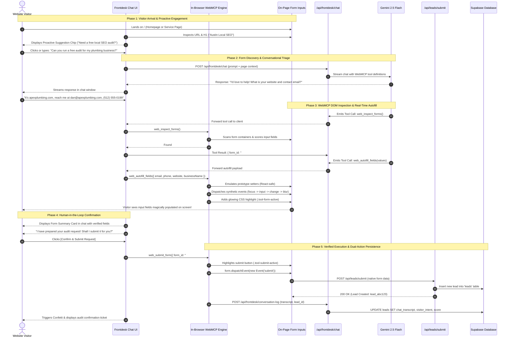
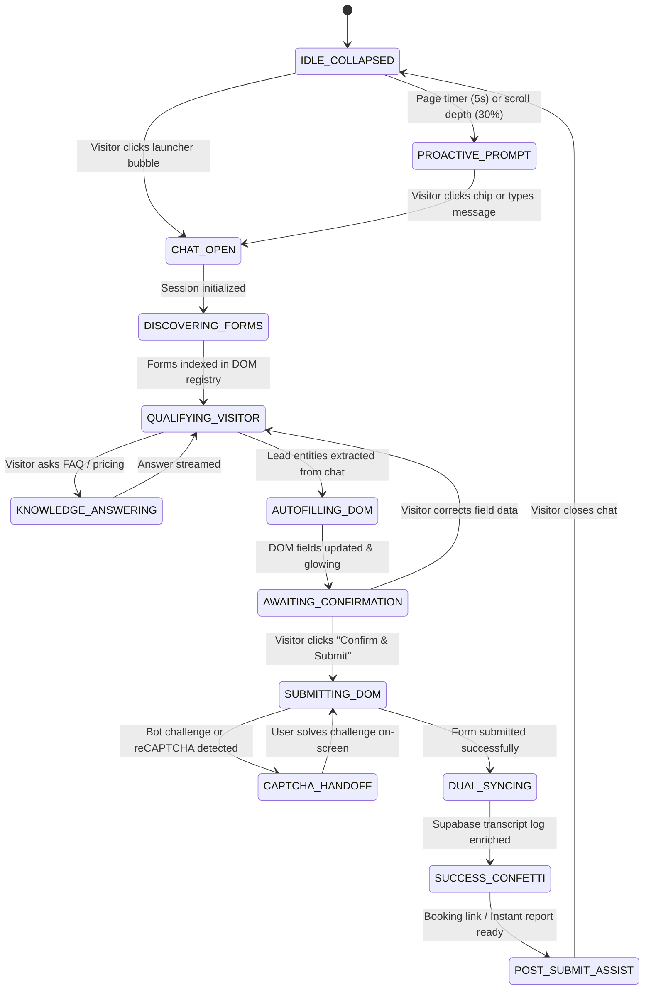

# AI Frontdesk Architecture & WebMCP Technical Specification
**LocalSurge SEO & Autonomous Web Client Conversion**  
**Version:** 1.1.0 (Production Blueprint with Visual Flows)  
**Status:** Approved Architectural Specification (Local Blueprint)  
**Last Updated:** September 12, 2026  

---

## 1. Executive Summary & Core Objective

The **AI Frontdesk** is an intelligent, page-aware conversational web widget engineered for `localsurgeseo.com` (and client web properties). It greets website visitors, answers technical and commercial questions with zero-latency grounded context, and autonomously qualifies prospective clients.

Rather than forcing visitors to manually navigate and re-type information into static web forms, the AI Frontdesk incorporates **WebMCP (Web Model Context Protocol)**. Through in-browser WebMCP tool execution, the agent dynamically discovers on-page lead capture forms, maps conversational data to input fields, visually autofills inputs in real time, and—upon explicit visitor confirmation—submits the lead on the customer's behalf into the site's existing lead pipeline.

---

## 2. End-to-End System Architecture Diagram

```mermaid
flowchart TB
    subgraph VISITOR_BROWSER ["Client Browser Session (localsurgeseo.com)"]
        direction TB
        V[Visitor] -->|Opens Page / Types Message| UI[Frontdesk Chat Widget]
        
        subgraph WEBMCP_ENGINE ["In-Browser WebMCP Runtime"]
            direction TB
            DISC["Form Discovery & Semantic Scorer"]
            INJECT["Native Setter Emulation & Event Cascade"]
            PULSE["Visual Glow Highlighter & Live Checklist"]
            SUBMIT_DISPATCH["Submit Event Controller"]
        end
        
        subgraph DOM_LAYER ["Active Webpage DOM Layer"]
            direction TB
            FORM_ELEM["On-Page Lead Form (#audit-form)"]
            INPUTS["Inputs: name, email, phone, website, message"]
            BTN["Native Submit Button / CAPTCHA"]
            FORM_ELEM --- INPUTS --- BTN
        end
        
        UI <-->|Tool Calls & Form Feedback| WEBMCP_ENGINE
        INJECT -->|focus -> input -> change -> blur| INPUTS
        PULSE -->|CSS tool-form-active / highlights| INPUTS
        SUBMIT_DISPATCH -->|form.dispatchEvent(submit)| FORM_ELEM
    end

    subgraph BACKEND_GATEWAY ["Node.js / Express Server API"]
        direction TB
        CHAT_API["/api/frontdesk/chat (SSE Stream)"]
        LEADS_API["/api/leads/submit (Native Lead Handler)"]
        LOG_API["/api/frontdesk/conversation-log (Enrichment)"]
        KNOWLEDGE["Static Knowledge Manifest (frontdesk-knowledge.json)"]
    end

    subgraph CLOUD_SERVICES ["AI & Cloud Persistence Services"]
        direction TB
        GEMINI["Gemini 2.5 Flash Engine (Google AI)"]
        SUPABASE[("Supabase PostgreSQL ('leads' table)")]
        RESEND["Resend Email Service (Lead Alerts)"]
    end

    UI <-->|SSE Stream & JSON-RPC| CHAT_API
    CHAT_API <-->|Page Context + Tools| GEMINI
    CHAT_API --- KNOWLEDGE

    FORM_ELEM -->|POST Application/JSON| LEADS_API
    LEADS_API -->|Insert Initial Lead| SUPABASE
    LEADS_API -->|Dispatch Notification| RESEND

    WEBMCP_ENGINE -->|POST Transcript & Intent| LOG_API
    LOG_API -->|Enrich Lead with Conversation Logs| SUPABASE

    classDef browser fill:#123e35,stroke:#267d6c,color:#ffffff;
    classDef engine fill:#1e293b,stroke:#38bdf8,color:#ffffff;
    classDef dom fill:#292524,stroke:#f59e0b,color:#ffffff;
    classDef server fill:#1c1917,stroke:#a8a29e,color:#ffffff;
    classDef cloud fill:#042f2e,stroke:#10b981,color:#ffffff;

    class V,UI browser;
    class DISC,INJECT,PULSE,SUBMIT_DISPATCH engine;
    class FORM_ELEM,INPUTS,BTN dom;
    class CHAT_API,LEADS_API,LOG_API,KNOWLEDGE server;
    class GEMINI,SUPABASE,RESEND cloud;
```

---

## 3. Detailed Execution Sequence Flow

The following sequence details how the conversational agent coordinates with the browser DOM, the visitor, and the backend from initial page landing to verified form submission:



---

## 4. Finite State Machine (FSM) Lifecycle

The AI Frontdesk operates as a deterministic 10-state finite state machine with automatic fallback and recovery routines:



---

## 5. Architecture Pillars

| Pillar | Architectural Decision | Key Benefit |
| :--- | :--- | :--- |
| **Execution Model** | Client-Side In-Browser WebMCP | Executes directly in visitor session; zero headless browser latency; leverages visitor cookies/session. |
| **Interaction Pattern** | Visual Autofill + Chat Confirmation | High trust; visitor sees fields populate in real time with an explicit "Confirm & Submit" card. |
| **Form Discovery** | Hybrid Declarative (`data-frontdesk-lead-form`) + Semantic Heuristic Scoring | 100% deterministic on LocalSurge pages while plug-and-play on any client or third-party site. |
| **State Compatibility** | Native Setter Emulation (`HTMLInputElement.prototype`) | Compatible with React, Vue, Angular, Svelte, and vanilla HTML without broken state bindings. |
| **LLM Inference** | Gemini 2.5 Flash via Server-Sent Events (SSE) | Fast, low-latency streaming (<600ms TTFT), cost-effective tool-calling, secure server API keys. |
| **Knowledge Engine** | Hybrid Page-Aware Context + Static Knowledge Manifest | Contextual to current URL/service + instant factual answers without external vector DB dependencies. |
| **Security Layer** | Whitelist-Only Fields + XSS Sanitizer + CSRF Preservation | Zero credential/payment field exposure; sanitizes all injected values; prevents form spamming. |
| **Data Sync** | Dual-Action Submission (Native Form Trigger + Supabase Log) | Fires existing notification workflows (Resend/Zapier) while logging full conversational transcript in Supabase. |

---

## 6. Client-Side WebMCP Specification

### 6.1 Model Context Protocol (MCP) Tool Contract

The backend agent defines three strictly typed tools exposed to Gemini 2.5 Flash:

#### Tool 1: `web_inspect_forms`
* **Purpose:** Inspects the current page DOM to detect lead/contact forms, available inputs, and validation requirements.
* **Input Schema:**
  ```json
  {
    "type": "object",
    "properties": {
      "force_rescan": {
        "type": "boolean",
        "description": "Force fresh DOM query ignoring cached form descriptors."
      }
    }
  }
  ```
* **Output Payload:**
  ```json
  {
    "detected_forms": [
      {
        "form_id": "audit-lead-form",
        "selector": "#audit-form",
        "confidence_score": 0.96,
        "is_declarative": true,
        "fields": [
          { "field_key": "contact_name", "selector": "input[name='name']", "required": true, "type": "text" },
          { "field_key": "email", "selector": "input[name='email']", "required": true, "type": "email" },
          { "field_key": "phone", "selector": "input[name='phone']", "required": false, "type": "tel" },
          { "field_key": "website", "selector": "input[name='website']", "required": false, "type": "url" },
          { "field_key": "message", "selector": "textarea[name='notes']", "required": false, "type": "textarea" }
        ],
        "has_captcha": false
      }
    ]
  }
  ```

#### Tool 2: `web_autofill_fields`
* **Purpose:** Sets values for matched input fields using native property descriptors, triggers framework synthetic events, and adds visual highlight styling.
* **Input Schema:**
  ```json
  {
    "type": "object",
    "required": ["form_id", "field_values"],
    "properties": {
      "form_id": { "type": "string" },
      "field_values": {
        "type": "object",
        "properties": {
          "contact_name": { "type": "string" },
          "email": { "type": "string" },
          "phone": { "type": "string" },
          "website": { "type": "string" },
          "business_name": { "type": "string" },
          "message": { "type": "string" },
          "service_type": { "type": "string" }
        }
      }
    }
  }
  ```
* **Output Payload:**
  ```json
  {
    "success": true,
    "fields_updated": ["contact_name", "email", "phone", "website"],
    "missing_required_fields": []
  }
  ```

#### Tool 3: `web_submit_form`
* **Purpose:** Programmatically submits the form after the customer clicks "Confirm & Submit" or gives explicit verbal/text consent in chat.
* **Input Schema:**
  ```json
  {
    "type": "object",
    "required": ["form_id", "confirmation_token"],
    "properties": {
      "form_id": { "type": "string" },
      "confirmation_token": { "type": "string", "description": "Client-generated token validating user confirmation." }
    }
  }
  ```
* **Output Payload:**
  ```json
  {
    "status": "submitted",
    "http_status": 200,
    "confirmation_message": "Lead received successfully."
  }
  ```

---

### 6.2 Form Discovery & Scoring Algorithm

When a page does not declare `data-frontdesk-lead-form="true"`, WebMCP evaluates candidate `<form>` and container elements using a weighted heuristic:

$$\text{Confidence} = \sum w_i \cdot s_i$$

1. **Input Signal ($w = 0.40$):** Presence of `email` (0.20), `phone|tel` (0.10), `name` (0.10).
2. **Action/Endpoint Signal ($w = 0.20$):** Action contains `/api/leads`, `contact`, `quote`, `audit`, `submit`.
3. **Button Label Signal ($w = 0.20$):** Submit button text contains *"Get Audit"*, *"Request Quote"*, *"Contact"*, *"Book"*, *"Submit"*.
4. **Negative Filtering ($w = -0.50$):** Containers matching `input[type="search"]`, newsletter-only forms (1 single email input with *"Subscribe"*), or login/password forms are disqualified.

---

### 6.3 Reactive Framework State Emulation

To ensure React, Vue, Svelte, and vanilla HTML state remain synchronized without UI desync:

```typescript
export function injectFormValue(element: HTMLInputElement | HTMLTextAreaElement, value: string): void {
  // 1. Resolve prototype descriptor to bypass React 16+ setter interception
  const prototype = Object.getPrototypeOf(element);
  const descriptor = Object.getOwnPropertyDescriptor(prototype, 'value');

  if (descriptor && descriptor.set) {
    descriptor.set.call(element, value);
  } else {
    element.value = value;
  }

  // 2. Dispatch full synthetic lifecycle
  element.dispatchEvent(new Event('focus', { bubbles: true }));
  element.dispatchEvent(new Event('input', { bubbles: true }));
  element.dispatchEvent(new Event('change', { bubbles: true }));
  element.dispatchEvent(new Event('blur', { bubbles: true }));

  // 3. Visual pulse indicator
  element.classList.add('tool-form-active');
}
```

---

## 7. FossFLOW Visual Blueprint Specification

For visual diagrams in FossFLOW (located locally in `/home/ved/Websites/FossFLOW`), the architecture maps directly into the following isometric diagram schema:

```json
{
  "title": "LocalSurge AI Frontdesk & WebMCP Architecture",
  "colors": [
    { "id": "emerald", "value": "#10b981" },
    { "id": "darkgreen", "value": "#123e35" },
    { "id": "blue", "value": "#0284c7" },
    { "id": "amber", "value": "#f59e0b" },
    { "id": "purple", "value": "#8b5cf6" }
  ],
  "items": [
    {
      "id": "visitor",
      "type": "isoflow__person",
      "position": { "x": 50, "y": 150 },
      "name": "Website Visitor",
      "description": "Engages with site & asks for SEO audit"
    },
    {
      "id": "frontdesk-widget",
      "type": "isoflow__web_app",
      "position": { "x": 200, "y": 150 },
      "name": "AI Frontdesk Widget",
      "description": "Glassmorphic chat drawer with proactive chips"
    },
    {
      "id": "webmcp-engine",
      "type": "isoflow__microservice",
      "position": { "x": 350, "y": 150 },
      "name": "WebMCP Client Engine",
      "description": "In-browser DOM discovery, setter emulation, and highlight engine"
    },
    {
      "id": "onpage-form",
      "type": "isoflow__component",
      "position": { "x": 350, "y": 280 },
      "name": "On-Page HTML Form",
      "description": "Target lead capture form on localsurgeseo.com"
    },
    {
      "id": "server-api",
      "type": "isoflow__api",
      "position": { "x": 520, "y": 150 },
      "name": "Express Gateway",
      "description": "/api/frontdesk/chat & /api/leads/submit"
    },
    {
      "id": "gemini-ai",
      "type": "isoflow__cloud",
      "position": { "x": 680, "y": 80 },
      "name": "Gemini 2.5 Flash",
      "description": "SSE streaming LLM reasoning & WebMCP tool-calling"
    },
    {
      "id": "supabase-db",
      "type": "isoflow__database",
      "position": { "x": 680, "y": 220 },
      "name": "Supabase Postgres",
      "description": "Persistent leads table & chat transcripts"
    },
    {
      "id": "resend-service",
      "type": "isoflow__notification",
      "position": { "x": 520, "y": 280 },
      "name": "Resend Alerts",
      "description": "Dispatches instant email notification with lead details"
    }
  ],
  "connectors": [
    { "id": "c1", "from": "visitor", "to": "frontdesk-widget", "name": "1. Chat & Request Audit", "color": "emerald" },
    { "id": "c2", "from": "frontdesk-widget", "to": "server-api", "name": "2. Stream SSE Request", "color": "blue" },
    { "id": "c3", "from": "server-api", "to": "gemini-ai", "name": "3. Prompt & WebMCP Schemas", "color": "purple" },
    { "id": "c4", "from": "gemini-ai", "to": "frontdesk-widget", "name": "4. Tool Calls & Tokens", "color": "purple" },
    { "id": "c5", "from": "frontdesk-widget", "to": "webmcp-engine", "name": "5. Execute WebMCP Tools", "color": "blue" },
    { "id": "c6", "from": "webmcp-engine", "to": "onpage-form", "name": "6. Native Autofill & Glow", "color": "amber" },
    { "id": "c7", "from": "visitor", "to": "frontdesk-widget", "name": "7. Confirm & Submit Click", "color": "emerald" },
    { "id": "c8", "from": "webmcp-engine", "to": "onpage-form", "name": "8. Dispatch Submit Event", "color": "amber" },
    { "id": "c9", "from": "onpage-form", "to": "server-api", "name": "9. POST /api/leads/submit", "color": "darkgreen" },
    { "id": "c10", "from": "server-api", "to": "supabase-db", "name": "10. Store Lead & Transcript", "color": "darkgreen" },
    { "id": "c11", "from": "server-api", "to": "resend-service", "name": "11. Dispatch Email Alert", "color": "emerald" }
  ],
  "fitToScreen": true
}
```

---

## 8. Security, Privacy & Bot Protection

1. **Strict Field Whitelist:** WebMCP can only read or write to fields mapped to `NAME`, `EMAIL`, `PHONE`, `WEBSITE`, `COMPANY`, `SERVICE`, `MESSAGE`, and `BUDGET`.
2. **Sensitive Element Quarantine:** Inputs of `type="password"`, `type="hidden"`, credit card identifiers (`cc-number`, `cvv`, `exp`), or elements with `autocomplete="current-password"` are strictly quarantined and never touched.
3. **CSRF & Honeypot Integrity:** Hidden anti-CSRF tokens and spam honeypot fields are preserved untouched in the DOM.
4. **Session Rate Limiting:** Maximum 3 form submissions per IP/session per hour via WebMCP to prevent form flooding.

---

## 9. Data Synchronization & Lead Enrichment Pipeline

When WebMCP submits the lead:

```
[WebMCP Event: submit_confirmed]
            │
            ├──> 1. Native DOM Submit Event -> Calls /api/leads/submit -> Saves to Supabase 'leads' table
            │                                                         -> Triggers Resend Alert Email
            │
            └──> 2. Calls /api/frontdesk/conversation-log
                     │
                     └──> Updates lead record with:
                           - chat_transcript: JSON
                           - visitor_intent: string ("Austin Emergency Plumbing SEO")
                           - pages_viewed: ["/", "/pricing", "/locations/tx/austin"]
                           - qualification_score: number (1-100)
```

---

## 10. Local Development & Planning Status

> **Note on Environment & Source Control:**
> All AI Frontdesk architecture and WebMCP specifications are maintained strictly in local storage (`newlocalsurge` and `FossFLOW` under `/home/ved/Websites`). No premature git pushes to remote GitHub repositories will take place until the architecture, workflows, and test plan have been fully validated locally.
